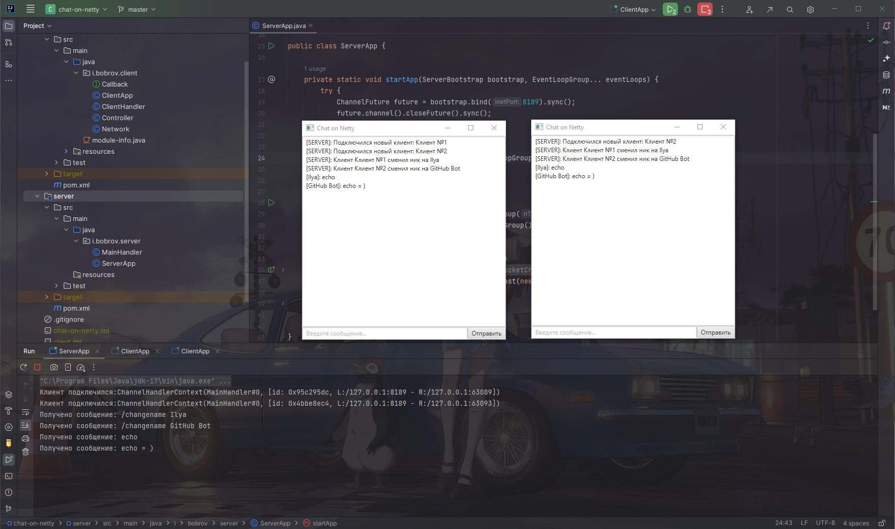

# Chat on Netty 

**Что делает проект?** Небольшое демо приложение, показывающее сетевое взаимодействие клиент-сервера. Я написал простой сервер на **Netty** и клиент на **JavaFX**, которые подключаются через сокеты.

***Netty*** — это клиент-серверная среда NIO, которая позволяет быстро и легко разрабатывать сетевые приложения, такие как серверы протоколов и клиенты. Это значительно упрощает и оптимизирует сетевое программирование, такое как сервер сокетов TCP и UDP.

«***Быстро и просто***» не означает, что полученное приложение будет иметь проблемы с удобством сопровождения или производительностью. Netty была тщательно разработана с учетом опыта, полученного при реализации множества протоколов, таких как FTP, SMTP, HTTP, а также различных устаревших двоичных и текстовых протоколов. В результате Netty удалось найти способ добиться простоты разработки, производительности, стабильности и гибкости без каких-либо компромиссов.

--------
## Используемые технологии

- Java 17
- Maven 4
- Netty 4.1
- JavaFX 17.0.6

--------
## Как запустить демо приложение?

Приложение выполняет роль демо, поэтому запускается в **IDEA**, **Eclipse** и др. IDE, а не как jar.

1. Запустите *ServerApp.main()* в модуле **server**.
2. Запустите *ClientApp.main()* в модуле **client**.
3. Дополнительные клиенты можно запустить включив доп. настройку запуска в IDE.
В IDEA необходимо нажать "*more actions*" на запускаемой конфигурации и включить "*Allow multiple instances*".

--------
## Пример работы

